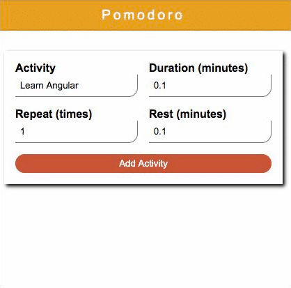

# Pomodoro

A Simple Pomodoro created in Angular 10 during the Front End Bootcamp of IGTI

## Technologies

## Preview

## Goals

- Work with dependence injection
- Allow user to create activities
- Run each activity and its rest time

## How it works

The project has four important files:

- `activity-interface.ts`: responsible by the structure of an activity
- `app.component.ts`: stores the list of activities created in `config.component`
- `config.component.ts`: allows the user to create a list of activities
- `timer.component.ts`: responsible to execute the pomodoro

The most important logic of the project is in `timer.component`. Here there are the control of execution of the list. When an activity runs, the red line of the image disappear with time. In rest interval a blue line appear and when it finishes start a new pomodoro.

## Final Notes

An improvement idea is create tomato thumbnails to represent the repetition of the activity and as it runs, these thumbnails disappear.
